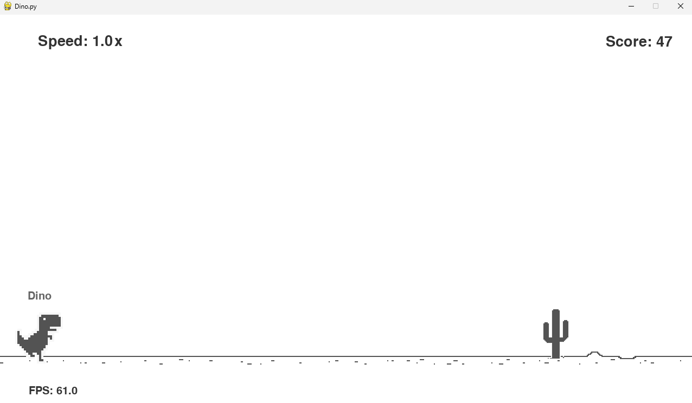
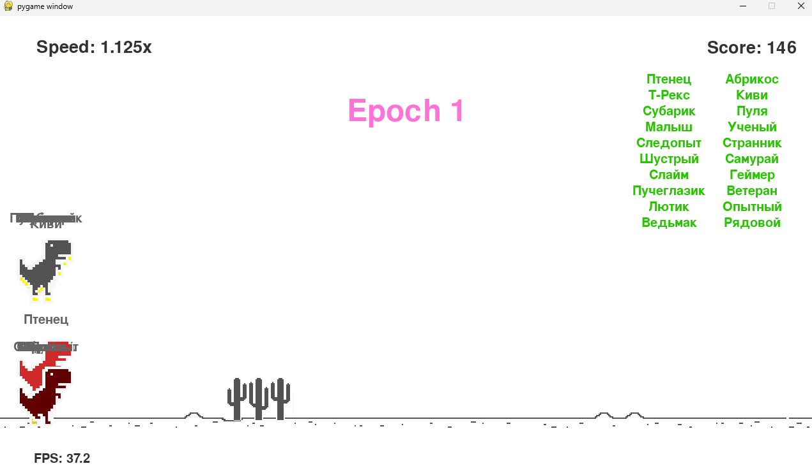

# Dino Game with Pygame and Neural Network Training

This repository contains two Python projects that bring the classic "Dino" game to life using the Pygame library. The first project is a simple recreation of the game, while the second project takes things a step further by implementing a neural network that learns to play the game autonomously.

## Files and Directories

### 1. `Dino.py`
This script is a Pygame-based recreation of the iconic "Dino" game, where the player controls a dinosaur that must jump over cacti to survive. This version includes several enhancements:
- **FPS Display**: Shows the current frames per second (FPS) during gameplay.
- **Speed Indicator**: Displays the running speed of the dinosaur, which increases over time.
- **Customizable Dinosaur**: The dinosaur’s name and skin can be customized, adding a personal touch to the game.

This implementation serves as a foundation for understanding how Pygame can be used to create interactive games with additional features.

### 2. `DinosaurAI.py`
This script takes the Dino game to the next level by incorporating artificial intelligence. Using the [NEAT](https://neat-python.readthedocs.io/en/latest/) (NeuroEvolution of Augmenting Topologies) algorithm, the project trains a neural network to play the game automatically, evolving its ability to avoid obstacles and achieve high scores without human intervention.

#### How It Works:
- **Game Integration**: Pygame is used to simulate the game environment, where multiple dinosaurs, each controlled by its own neural network, attempt to avoid cacti and survive as long as possible.
- **Neural Network Training**: The NEAT algorithm is responsible for evolving the neural networks. Each dinosaur's performance is evaluated based on how long it survives and how well it avoids obstacles.
- **Evolutionary Process**: Over successive generations, the neural networks improve as NEAT optimizes both the network's structure and its weights. Poorly performing dinosaurs are removed from the population, while successful ones pass on their traits to the next generation.
- **Configuration**: The `config-feedforward.txt` file contains the parameters for the NEAT algorithm, such as population size, mutation rates, and network topology settings. These parameters are crucial for guiding the evolution process and achieving optimal performance.

#### Key Features:
- **Autonomous Gameplay**: The trained neural network can play the game without any human input, making decisions in real-time to jump over cacti based on the game’s state.
- **Scalability**: The project is designed to handle multiple dinosaurs simultaneously, each with its own neural network, showcasing the potential of using NEAT for evolving AI in complex environments.
- **Visualization**: The game screen displays the current score, game speed, and the names of the remaining dinosaurs, providing a clear view of the AI's progress.

### 3. `config-feedforward.txt`
This configuration file defines the settings for the NEAT algorithm used in `DinosaurAI.py`. It specifies how the neural networks should be initialized, how they evolve over generations, and the criteria for selecting the best-performing networks. This file is essential for customizing the neural network’s evolution to achieve the desired gameplay performance.

#### NEAT Configuration

- **Fitness Criterion**: 
  - `fitness_criterion = max`: The fitness of a genome is determined by its maximum performance during the simulation. This means that the network's success is measured by its best score in avoiding obstacles.
  
- **Fitness Threshold**: 
  - `fitness_threshold = 10000`: Training continues until a network achieves a fitness score of 10,000, which represents the desired level of performance for the AI to master the game.
  
- **Population Size**: 
  - `pop_size = 20`: The algorithm maintains a population of 20 neural networks (genomes) each generation. A smaller population allows for faster iterations but may require more generations to achieve optimal results.

- **Reset on Extinction**: 
  - `reset_on_extinction = False`: If all species go extinct during evolution, the algorithm does not reset the entire population. This setting ensures the continuity of the evolutionary process.

#### Genome Configuration

- **Activation Function**: 
  - `activation_default = tanh`: The hyperbolic tangent function is used as the default activation function for neurons, providing smooth, non-linear transformations that help in learning complex patterns.
  - `activation_mutate_rate = 0.01`: The probability of mutation altering the activation function of a node is set to 1%, ensuring stability with occasional exploration of different functions.

- **Aggregation Function**: 
  - `aggregation_default = sum`: Neurons aggregate their inputs by summing them, which is a common approach for combining signals in neural networks.
  - `aggregation_mutate_rate = 0.01`: The mutation rate for changing the aggregation method is minimal, promoting consistency.

- **Bias Configuration**: 
  - Biases are initialized with a mean of 0.0 and a standard deviation of 1.0, allowing for a wide range of initial bias values.
  - Mutation rates for biases are significant (`bias_mutate_rate = 0.7`), indicating frequent adjustments to fine-tune network performance.

- **Connection Management**: 
  - `conn_add_prob = 0.5` and `conn_delete_prob = 0.5`: There is an equal probability of adding or removing connections between nodes, which promotes flexibility in evolving network topology.
  - `enabled_default = True`: Connections are enabled by default, and the probability of a connection being disabled or re-enabled is low (`enabled_mutate_rate = 0.01`), ensuring networks maintain functionality through generations.

- **Node Management**: 
  - `node_add_prob = 0.2` and `node_delete_prob = 0.2`: New nodes can be added or removed with a 20% chance, allowing the network to grow in complexity over time or simplify if necessary.

- **Network Architecture**: 
  - The neural network starts with no hidden layers (`num_hidden = 0`), relying solely on the inputs and outputs.
  - Inputs (`num_inputs = 4`) include factors like the dinosaur’s position, distance to the obstacle, and the game speed.
  - There is one output (`num_outputs = 1`), which controls the dinosaur’s action (e.g., jump).

- **Weight Configuration**: 
  - Initial connection weights are centered around 0.0 with a standard deviation of 1.0, and mutations can alter these weights with a probability of 80% (`weight_mutate_rate = 0.8`), allowing the network to explore a wide range of behaviors.

#### Species and Reproduction

- **Species Compatibility**: 
  - `compatibility_threshold = 3.0`: This setting determines how different two genomes must be to be considered separate species, promoting diversity within the population.

- **Stagnation Control**: 
  - `max_stagnation = 20`: A species is considered stagnant if it does not improve after 20 generations, at which point it risks being replaced.
  - `species_elitism = 2`: The top 2 genomes from each species are preserved into the next generation, ensuring the survival of the best-performing networks.

- **Reproduction**: 
  - `elitism = 3`: The best 3 genomes from each generation are directly passed to the next, ensuring that successful traits are retained.
  - `survival_threshold = 0.2`: Only the top 20% of the population survives to reproduce, encouraging the propagation of the fittest genomes.

---

This repository demonstrates the intersection of game development and artificial intelligence. By combining Pygame with NEAT, it not only recreates a beloved game but also explores how AI can learn to master complex tasks autonomously. Whether you're interested in game development, neural networks, or evolutionary algorithms, this project provides a hands-on example of how these technologies can work together.
